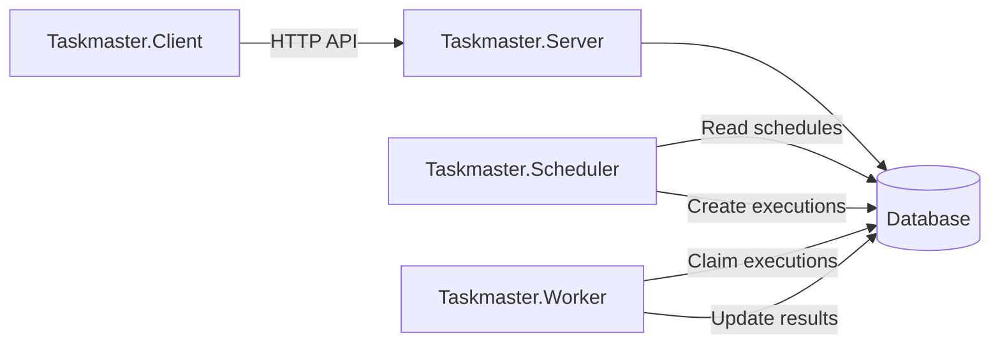
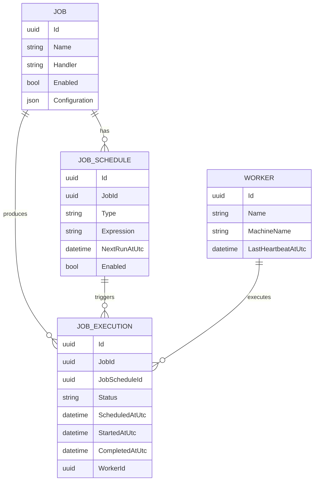
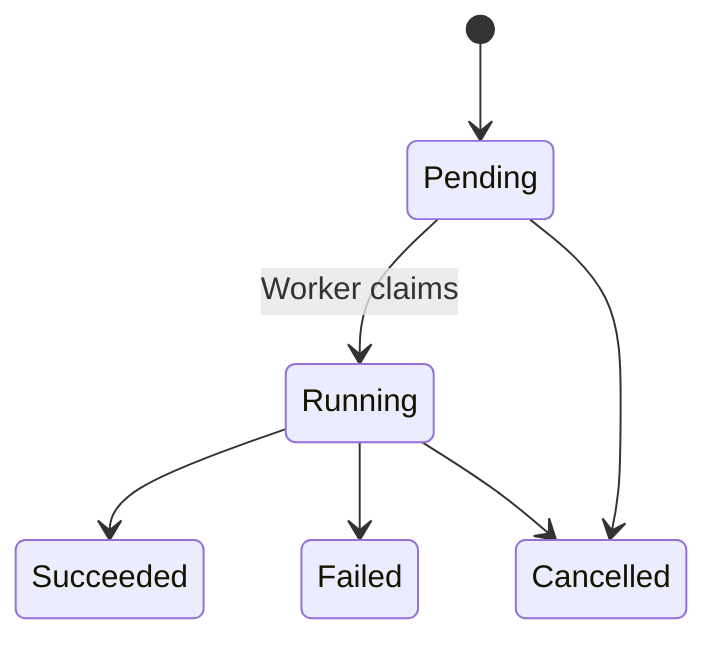
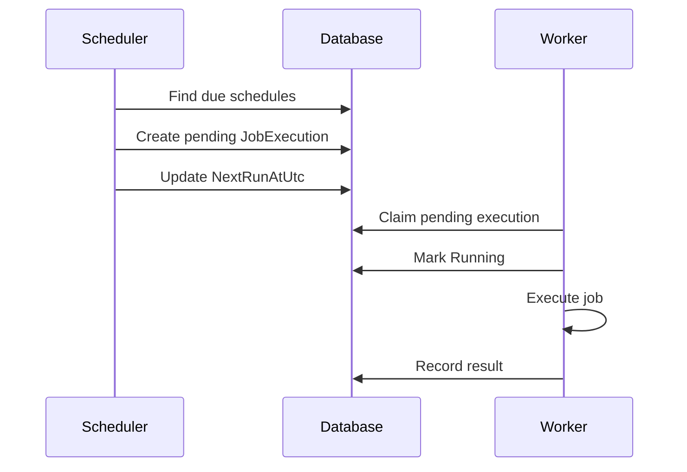

# Taskmaster

Taskmaster is a distributed job scheduling and execution system built with .NET.

It provides a central place to define jobs, configure when they run, track their executions, and execute work across one or more workers.

The core design separates **what should run**, **when it should run**, and **where it runs**.

## Architecture

Taskmaster consists of four applications:

| Project                  | Responsibility                                                         |
| ------------------------ | ---------------------------------------------------------------------- |
| `Taskmaster.Client`    | Frontend for managing jobs, schedules, workers, and execution history. |
| `Taskmaster.Server`    | Backend API and primary interface to the database.                     |
| `Taskmaster.Scheduler` | Windows service that evaluates schedules and creates job executions.   |
| `Taskmaster.Worker`    | Windows service that claims pending executions and runs them.          |

## Core Model

Taskmaster separates job configuration, scheduling, and execution into distinct concepts.

### Job

A **Job** defines what Taskmaster can execute.

A job contains a handler identifying the implementation and configuration required by that handler.

Examples:

* Generate a report
* Execute a SQL query
* Transfer files
* Call an external API

Job-specific configuration is stored separately from scheduling configuration.

### Job Schedule

A **JobSchedule** defines when a Job should run.

Schedules may support mechanisms such as:

* Cron expressions
* Intervals
* One-time execution

The scheduler maintains `NextRunAtUtc`, allowing due schedules to be located efficiently without continuously recalculating every schedule.

### Job Execution

A **JobExecution** represents one specific request to execute a Job.

Executions may originate from a schedule or from a manual request.

Typical lifecycle:

Execution history is retained independently from the Job and its Schedule.

## Execution Flow

Scheduled execution follows a simple pipeline:

The components intentionally have narrow responsibilities:

**Scheduler**

* Determines when jobs are due.
* Creates executions.
* Calculates the next scheduled occurrence.
* Never executes jobs.

**Worker**

* Claims pending executions.
* Executes job handlers.
* Records success or failure.
* Never evaluates schedules.

**Server**

* Provides the API used by the Client.
* Manages jobs, schedules, executions, and workers.
* Provides operational and historical information.

## Design Principles

Taskmaster should remain:

* **Simple** — components have narrow, obvious responsibilities.
* **Reliable** — executions are persisted before work begins.
* **Extensible** — new job handlers and scheduling mechanisms can be added without redesigning the system.
* **Scalable** — multiple workers can independently claim work.
* **Observable** — every execution has a persistent status and history.

The fundamental workflow is:

> **Job → Schedule → Execution → Worker**

A Job defines **what** to do.
A Schedule defines **when** to do it.
An Execution represents **one occurrence** of that work.
A Worker determines **where it runs**.
